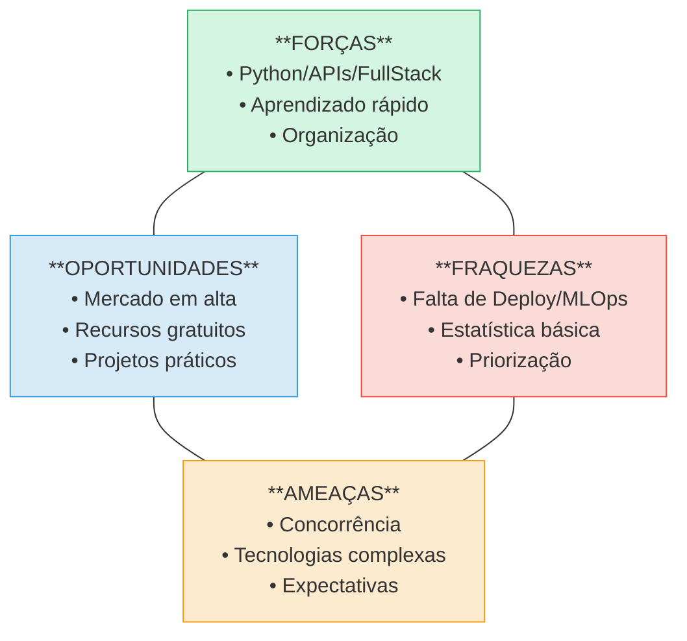

🧭 Plano de Desenvolvimento Individual (PDI) – Inteligência Artificial
1. 🧠 Quem sou eu hoje?
Habilidades atuais (já desenvolvidas):

 - Python básico/intermediário

 - Fundamentos de IA e estatística

 - Lógica de programação / Git / Linux

 - Soft skills (comunicação, aprendizado autônomo)

2. 🧑‍🚀 Quem quero ser no futuro?
Objetivo: Ser um desenvolvedor especializado em Inteligência Artificial Generativa, aplicando LLMs, APIs (como OpenAI, Hugging Face)
e técnicas de Prompt Engineering, com foco em criação de produtos e aplicações inteligentes.

