🧭 Plano de Desenvolvimento Individual (PDI) – Inteligência Artificial
1. 🧠 Quem sou eu hoje?
Habilidades atuais (já desenvolvidas):

 Python básico/intermediário

 Fundamentos de IA e estatística

 Análise de dados com Pandas/Numpy

 Machine Learning supervisionado com Scikit-Learn

 Modelos preditivos básicos

 Lógica de programação / Git / Linux

 Soft skills (comunicação, aprendizado autônomo)

2. 🧑‍🚀 Quem quero ser no futuro?
Objetivo: Ser um desenvolvedor especializado em Inteligência Artificial Generativa, aplicando LLMs, APIs (como OpenAI, Hugging Face)
e técnicas de Prompt Engineering, com foco em criação de produtos e aplicações inteligentes.

3. 🛤️ Estabelecendo metas
✅ O que você já tem como habilidade?
Python para Ciência de Dados

Fundamentos de IA

Estatística e Álgebra Linear

Modelagem preditiva com Scikit-learn

Conhecimento básico em Machine Learning supervisionado

Soft skills (comunicação, colaboração, estudo autodirigido)

```mermaid
graph TD
    %% Layout 2x2
    F[**FORÇAS**<br>• Python/APIs/FullStack<br>• Aprendizado rápido<br>• Organização] --- W[**FRAQUEZAS**<br>• Falta de Deploy/MLOps<br>• Estatística básica<br>• Priorização]
    O[**OPORTUNIDADES**<br>• Mercado em alta<br>• Recursos gratuitos<br>• Projetos práticos] --- T[**AMEAÇAS**<br>• Concorrência<br>• Tecnologias complexas<br>• Expectativas]
    F --- O
    W --- T
    
    style F fill:#d5f5e3,stroke:#27ae60
    style W fill:#fadbd8,stroke:#e74c3c
    style O fill:#d6eaf8,stroke:#3498db
    style T fill:#fdebd0,stroke:#f39c12
```

